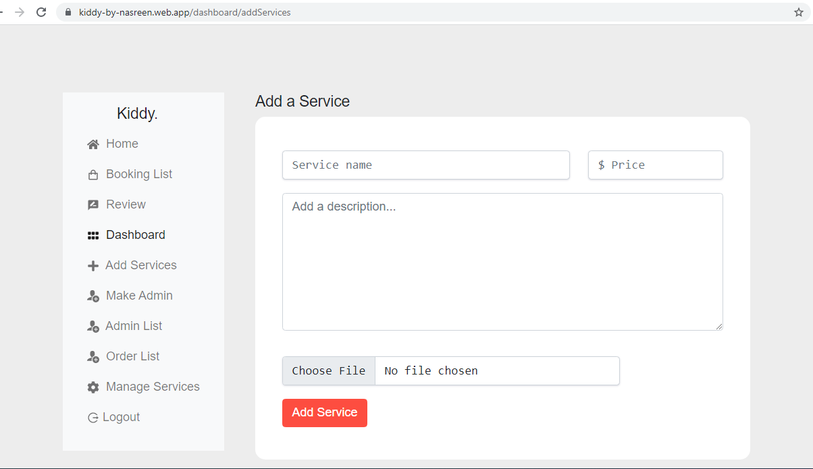

# Welcome to E-commerce website for kid’s play services.

This project was made to give different paly services to kids .The Project link is  (https://kiddy-by-nasreen.web.app/).

## Available Services

In this site there are 3 categorized services:

### Indoor Games
### Outdoor Game And Event
### Camping for Kids

It is a fully dynamic website. You can buy our services and also can give review.

 **Technologies are used to make this Site:**

*Bootstrap, React JS, Firebase (authentication)
* Heroku, Stripe API (temporarily creating dummy payment gateway)
* Firebase hosting and Mongodb used for databases.

#### Services Card to buy service:

#### Admin Dashboard to manage services:

#### Admin Dashboard to add new services:

#### User Dashboard to make payment by card:

#### User Dashboard to give service review:

